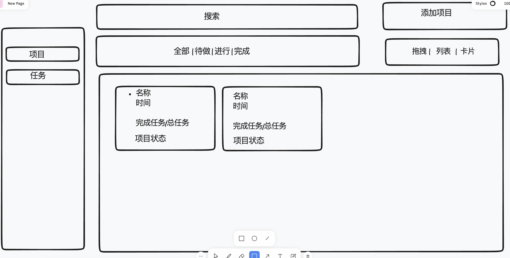
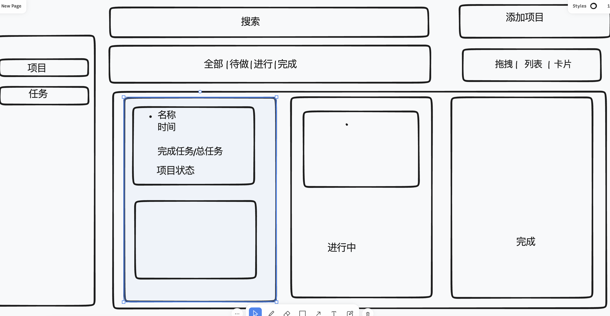
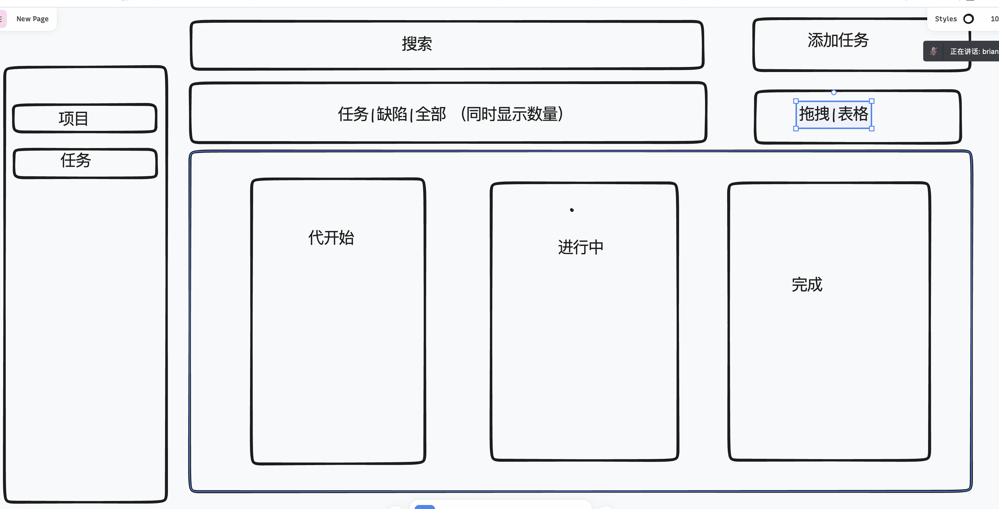

<!--
 * @Author: your name
 * @Date: 2021-11-28 15:33:14
 * @LastEditTime: 2021-12-14 20:49:09
 * @LastEditors: Please set LastEditors
 * @Description: 打开koroFileHeader查看配置 进行设置: https://github.com/OBKoro1/koro1FileHeader/wiki/%E9%85%8D%E7%BD%AE
 * @FilePath: /g-pm/REAMDE.md
-->
## ui

## link

https://g-pm.vercel.app/

https://g-pm.vercel.app/btn

https://g-pm.vercel.app/form

https://g-pm.vercel.app/weather

## 参考 ui
https://codepen.io/aybukeceylan/pen/gOpbRPO

https://dribbble.com/shots/16466111-Kanban-View-Concept
